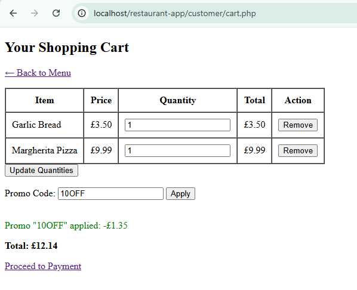
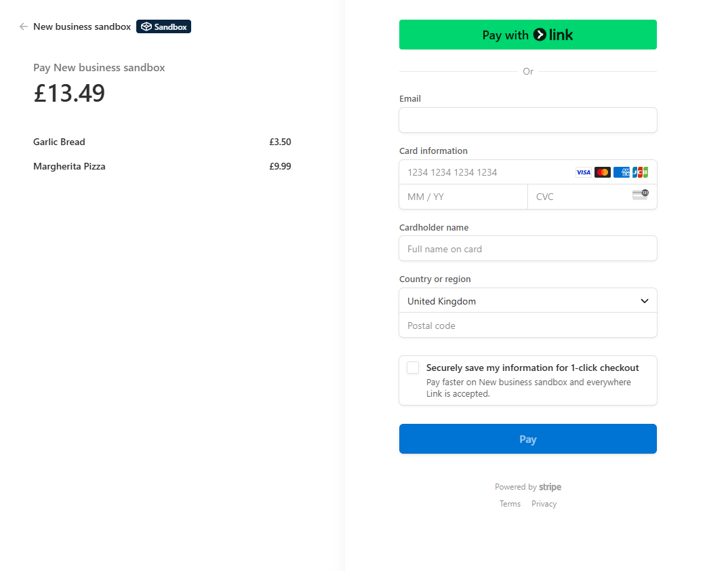
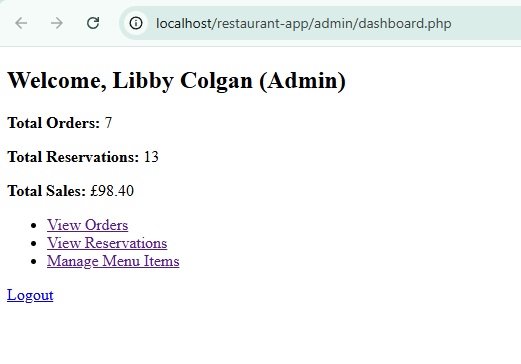

# 🍽️ Restaurant Reservation & Ordering System

A full-stack restaurant management web application built as part of my **Advanced Web Programming** module at Cardiff Metropolitan University. It allows customers to browse the menu, reserve tables, order food, apply discount codes, and pay securely via Stripe. Staff and admin users have their own dashboards to manage orders, reservations, and system activity.

---

## 🎓 University Project Details

- 📚 **Module**: Advanced Web Programming (CIS6028)  
- 🏫 **Institution**: Cardiff Metropolitan University  
- 📅 **Submitted**: May 2025  
- 🎯 **Grade-Aim**: Applied real-world full-stack practices with a focus on usability, security and modularity

---

## 💻 Key Features

### 👤 Customers
- Register and log in securely
- Browse and filter menu items
- Add items to cart with quantity and discount codes
- Reserve tables with time validation
- Pay using Stripe Checkout (secure, PCI-compliant)
- Receive email and on-screen booking confirmations

### 🛠️ Admin & Staff
- Admin dashboard with:
  - Menu item management (Add/Edit/Delete)
  - Reservation tracking and cancellation
  - View payment & order logs
  - Admin action logs with timestamps
- Staff dashboard:
  - View and update customer order statuses

---

## 🔐 Security Highlights

- Passwords hashed using `password_hash()`  
- Prepared statements to prevent SQL injection  
- Role-based access control for Admin, Staff, and Customers  
- Stripe Checkout ensures secure payments without storing card data  
- All admin actions logged for transparency

---

## 📸 Screenshots

| Customer Cart | Stripe Checkout | Admin Menu Manager |
|--------------------|------------------|---------------------|
|  |  |  |

## 🛠 Future Enhancements

- Mobile responsiveness  
- SMS/email webhooks for bookings  
- Granular role tiers (e.g., kitchen vs front of house staff)

